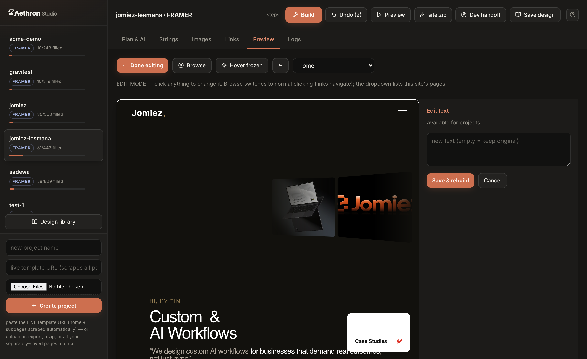
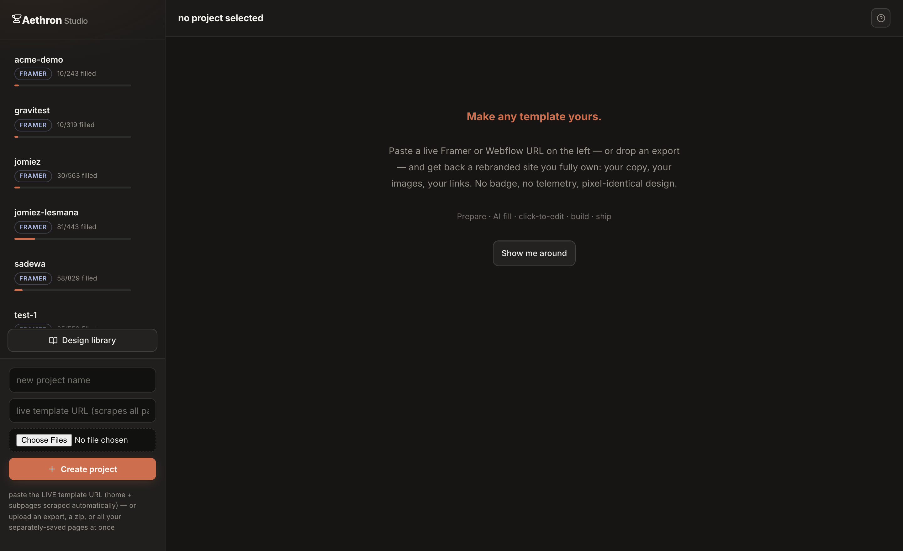
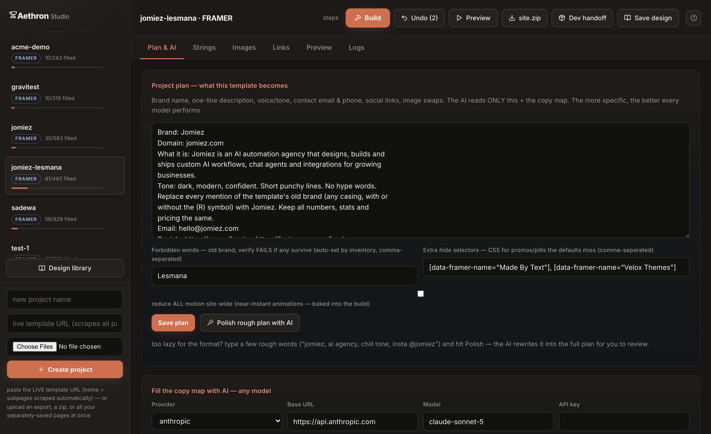
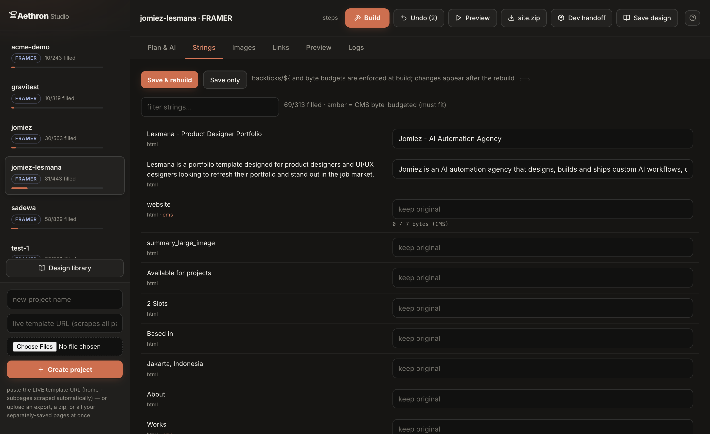
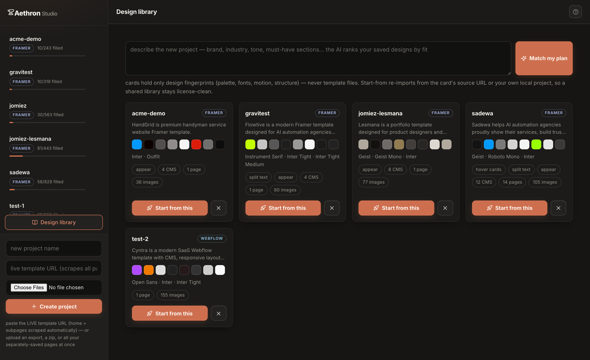

<div align="center">

# Aethron

### Make any Framer or Webflow template **permanently yours** — in minutes, driven by any AI.

Rebrand the copy, images, links, and logo. Keep the design and animations
**pixel-identical**. Strip the badge, the telemetry, the CDN dependency.
Ship it anywhere. All without hand-editing a single line of the export.

**Zero dependencies · three files · any AI model · guardrails that make breakage impossible.**

</div>

---

<div align="center">



*Click anything on the live template — text, image, button, section — and rewrite,
restyle, or remove it. Every change is baked into the shipped code.*

</div>

---

## The problem

You bought (or designed) a beautiful Framer or Webflow template. You want to make
it *yours* — your words, your images, your brand, no platform badge. So you open
the export and start editing.

**It fights back.** A Framer export is a frozen React app: the same headline lives
in the HTML, in ~60 minified JavaScript chunks, **and** in byte-offset-locked
binary CMS files. Change one and the runtime silently reverts it on hydration, or
the page unmounts to a black screen. Webflow embeds your template's brand name
inside CDN asset filenames — rename them and the stylesheet 404s. Serve the folder
on a normal static host and you get a blank page, because the CMS loader speaks a
byte-range protocol no static host implements.

Every naive edit is a landmine. **Aethron defuses all of them mechanically**, and
reduces the creative work to one JSON file that any AI model — or you, by clicking
on the page — can fill.

## How it works

```
   live URL / export.html / zip
              │
        ┌─────▼─────┐   scrape or unpack, detect platform, seal the original
        │   init    │
        └─────┬─────┘
        ┌─────▼─────┐   download the real runtime (chunks, CMS, icons, fonts)
        │   fetch   │
        └─────┬─────┘
        ┌─────▼─────┐   extract every text / image / link  →  copy_map.json
        │ inventory │
        └─────┬─────┘
              │   ← the ONE file an AI (or you) fills. Guardrails validate every value.
        ┌─────▼─────┐   apply to ALL THREE layers, byte-locked, hydration-safe
        │   build   │
        └─────┬─────┘
        ┌─────▼─────┐   machine checks: leftovers, budgets, dead refs, hide rules
        │  verify   │
        └─────┬─────┘
        ┌─────▼─────┐   self-heal any edit that didn't land — deterministically
        │   heal    │
        └───────────┘
```

The whole pipeline is exposed three ways: a **CLI**, a **visual Studio**, and an
**MCP server** so any AI agent drives it natively. `pristine/` is never touched;
`site/` is never hand-edited; **every change flows through `copy_map.json` and a
rebuild** — so hydration equality is guaranteed by construction, not by care.

---

## See it

<table>
<tr>
<td width="50%"><br><em>Paste a live URL or drop an export — every page scraped automatically.</em></td>
<td width="50%"><br><em>Write a rough plan in plain words; any model fills the copy map within hard byte budgets.</em></td>
</tr>
<tr>
<td width="50%"><br><em>Live UTF-8 byte-budget meters — CMS text can never overflow its slot.</em></td>
<td width="50%"><br><em>Every migration becomes a searchable design fingerprint — match new plans to saved designs.</em></td>
</tr>
</table>

---

## Quickstart

**Requirements:** Python 3.8+. That's it. (Nothing to `pip install` for the core —
the only optional dependency is `fonttools` for the logo generator.)

```bash
git clone https://github.com/zenadell/Aethron.git
cd Aethron
python3 studio.py            # → http://127.0.0.1:8899
```

1. **Bring a template** — paste a live Framer/Webflow **URL** (all pages scraped
   automatically), or drop an export `.html`, a `.zip`, or all your separately
   saved pages at once.
2. **Prepare project** — one click runs fetch → inventory → build with a progress bar.
3. **Fill it** — write a few rough words about your brand → **Polish** → **Fill with
   AI** (DeepSeek, Gemini, OpenAI, Claude, Ollama — or paste fills manually, no key
   needed).
4. **Edit mode** — click any text, image, button, or section on the live preview and
   rewrite, restyle, or remove it. The inspector docks beside the site so the whole
   template stays visible.
5. **Ship** — **site.zip** (fully static, deploys anywhere) or **Dev handoff** (the
   whole rebuildable project + content API + agent guide).

---

## What makes it unbreakable

| Hazard in a raw export | What Aethron does |
|---|---|
| **3-layer text** (HTML + JS chunks + CMS binaries) | Rewrites all three identically on every build; hydration equality by construction |
| **Byte-locked CMS binaries** | Replacements are space-padded to the exact byte length; URLs padded with `#000…` fragments so they never 404 |
| **Per-character split headings** | Regenerates the character-span run to spell the new text — animation fully preserved |
| **Rotating / typewriter phrases** | Surfaces the whole phrase cycle to edit at once |
| **Shared image slots** (one URL fills many spots) | Per-slot `content:url()` overrides distribute different images — hydration-proof |
| **Webflow CDN filenames embed the brand** | CDN URLs are vaulted before replacement and restored after — the stylesheet never breaks |
| **Static hosts show a blank page** | The CMS range-guard is patched to slice full-file responses client-side; icons ship with real `.js` names |
| **React re-creates deleted DOM** | Badges/credits are hidden with baked CSS, with a blast-radius guard so a generic selector can't nuke half the site |
| **An edit silently does nothing** | The build report flags it; `heal` fixes it deterministically or tells you exactly why it can't |

**Any model can drive it safely.** Every value an AI writes is validated server-side
(UTF-8 byte budgets, forbidden characters) and rejected with a teaching error.
Proven with DeepSeek filling live, and with **Gemini/Antigravity** driving a full
migration through the MCP server with zero human help.

## Self-healing edits

No user edit dead-ends. After every build, a report records how many times each
edit actually replaced something across all three layers. If an edit landed nowhere
— or would be reverted by hydration — Aethron **self-heals** without a model:

- **flex upgrade** — the source merely wraps/spaces the text differently
- **casing adoption** — matches a real source string except for case
- **nearest-source adoption** — a typo'd target ≥85% similar to exactly one real
  string is corrected to it (byte budgets still enforced)
- **honest STUCK** — anything it can't fix safely is reported with the exact reason
  and the closest candidates. It never guesses.

> **Why deterministic, not an AI fixing code?** Because a detector that knows *with
> certainty* what's wrong needs no model — and a model editing the platform's own
> code is exactly how you get silent corruption. Aethron keeps the model on the one
> job code can't do (judgment), and makes the mechanics unbreakable.

---

## Three ways to drive it

### 1. Visual Studio — `python3 studio.py`

The AI IDE. Upload/scrape, one-click prepare, AI fill (any provider or manual),
byte-budget meters, click-to-edit everything, live preview, undo, a first-run
walkthrough, and a design library. Everything routes through `forge.py`, so every
invariant holds.

### 2. CLI — `forge.py`

```bash
python3 forge.py init <url | export.html | dir> --name mybrand
cd mybrand
python3 forge.py fetch        # localize the runtime (chunks/CMS/icons)
python3 forge.py inventory    # → copy_map.json (the AI fills this)
python3 forge.py build        # apply to every layer, guarded
python3 forge.py verify       # machine checks before you ship
python3 forge.py heal         # self-heal broken fills (deterministic)
python3 forge.py localize     # optional: full CDN independence
python3 forge.py logo "Name"  # SVG wordmark in the template's own font
python3 forge.py backend      # content API + AGENT_GUIDE.md
python3 forge.py card         # design fingerprint → design_card.json
python3 forge.py serve 8777   # dev server with the Framer protocols
```

Only `logo` needs a dependency (`pip3 install fonttools brotli`); everything else
is pure standard library.

### 3. MCP server — `forge_mcp.py`

```jsonc
// .mcp.json — Claude Code, Antigravity, Cursor, any MCP client
{ "mcpServers": { "template-forge": {
    "command": "python3", "args": ["forge_mcp.py"] } } }
```

23 tools: create (from URL or file), fetch, inventory, plan, paged content read,
guarded bulk writes, styles, per-slot image replacement, logo generation, localize,
build, verify, **self-heal**, backend, preview, undo, and the design library.
**The agent is the copy model** — no API keys; the guardrails enforce the physics on
every call.

---

## Deploy it

Every `site/` build is **fully static** — no server logic required.

| Host | One step |
|---|---|
| **Cloudflare Pages** | drag the folder into the dashboard, or `npx wrangler pages deploy .` |
| **Netlify** | drag the folder onto app.netlify.com/drop |
| **Vercel** | `npx vercel .` |
| **GitHub Pages** | push the folder's contents to your `user.github.io` repo |
| **Any static host / S3 / nginx** | upload as-is |

Each build ships `_redirects`, `404.html`, `vercel.json`, and a `DEPLOY.md` with
per-host specifics. There's also a `serve.py` for running it locally.

### Host your own Studio instance

The Studio is a **single-user tool** — it writes to disk and runs subprocesses for
whoever can reach it. To let others try it, give each person their own instance:

```bash
# Docker
docker build -t aethron . && docker run -p 8899:8899 \
  -e STUDIO_PASSWORD=choose-a-password aethron
```

Or one-click on **Render** (free tier) via the included `render.yaml` — set
`STUDIO_PASSWORD` in the dashboard. **Always set a password before exposing an
instance to the internet.** (Free-tier disks are ephemeral — attach a volume to
`/app/projects` to persist migrations.)

---

## Project layout

```
mybrand/
├── forge.json        config: platform, pages/routes, forbidden words, source URL
├── pristine/         sealed original + downloaded runtime (never edited; sha256-manifested)
├── copy_map.json     THE file: strings / images / links / styles / removals
├── assets/           your replacement images — mirrored into the site
├── backend/          generated content API + agent guide (optional)
└── site/             generated output + serve.py + deploy configs (never hand-edited)
```

## Documentation

- **[docs/GETTING_STARTED.md](docs/GETTING_STARTED.md)** — your first migration, step by step
- **[docs/ARCHITECTURE.md](docs/ARCHITECTURE.md)** — how the three layers, guardrails, and self-heal work
- **[docs/DEPLOY.md](docs/DEPLOY.md)** — every hosting path in detail
- **[docs/MCP.md](docs/MCP.md)** — driving Aethron from an AI agent
- **[PLAYBOOK.md](PLAYBOOK.md)** — the deep physics: why exports fight back and how each rule was earned

## Status

Proven end-to-end on real templates across both platforms — multi-page live-site
scraping, real Webflow migrations, foreign-agent migration via MCP
(Gemini/Antigravity), per-slot image overrides, split-text and rotator editing,
self-healing, and static-host deployment. Backed by a **74-scenario regression
battery**, every one green.

## License

[MIT](LICENSE) © 2026 zenadell. Open source; use it, fork it, ship with it.

<div align="center"><sub>Built for people who buy beautiful templates and want to truly own them.</sub></div>
